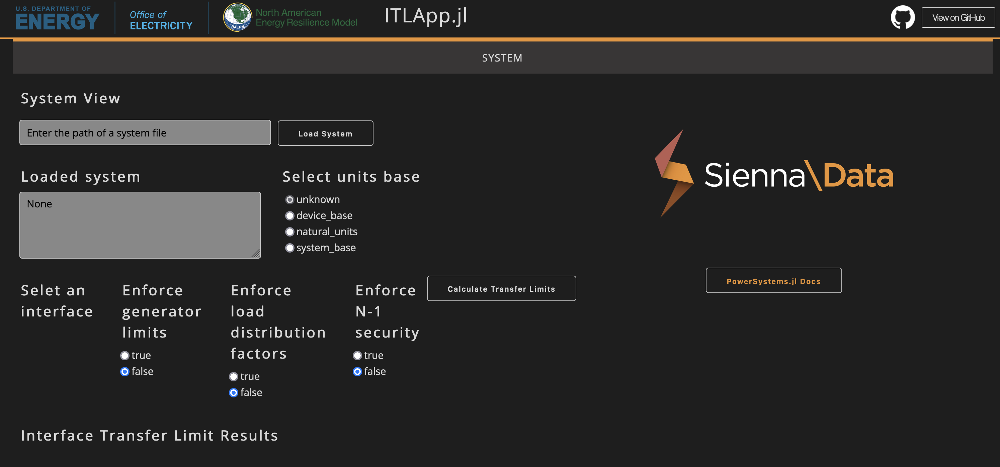

# ITLApp.jl

The `ITLApp.jl` package provides a GUI for calculating interface transfer limits with
[PowerSystems.jl](https://github.com/NREL-Sienna/PowerSystems.jl) and
[InterfaceLimits.jl](https://github.com/NREL-Sienna/InterfaceLimits.jl)
in a web app interface like the one shown here:



## Usage

```julia
julia> ]add https://github.com/nrel-sienna/ITLApp.jl
```

### ITLApp

This application allows users to load a load flow case data and calculate interface transfer limits
in a web UI via Plotly Dash. Here's how to start it:

```julia
julia> using ITLApp
julia> run_itl_app()
[ Info: Navigate browser to: http://0.0.0.0:8050
[ Info: Listening on: 0.0.0.0:8050
```

Open your browser to the IP address and port listed. In this case: `http://0.0.0.0:8050`.

## Developers

Consult https://dash.plotly.com/julia for help extending the UI.

Set the environment variable `SIENNA_DEBUG` to enable hot-reloading of the UI.

Mac or Linux
```
$ export SIENNA_DEBUG=1
# or
$ SIENNA_DEBUG=1 julia --project src/itl_app.jl
```

Windows PowerShell
```
$Env:SIENNA_DEBUG = "1"
```

## License

PowerApps.jl is released under a BSD [license](https://github.com/NREL/ITLApp.jl/blob/master/LICENSE).
PowerApps.jl has been developed as part of the Sienna
ecosystem at the U.S. Department of Energy's National Renewable Energy Laboratory ([NREL](https://www.nrel.gov/)).
